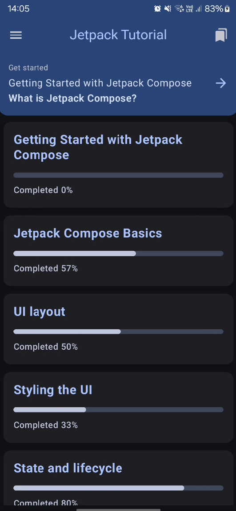
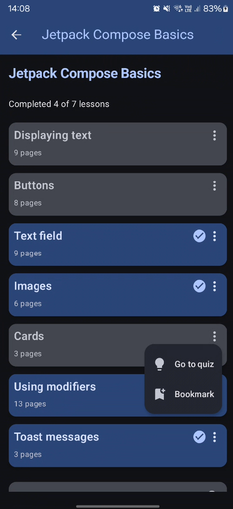
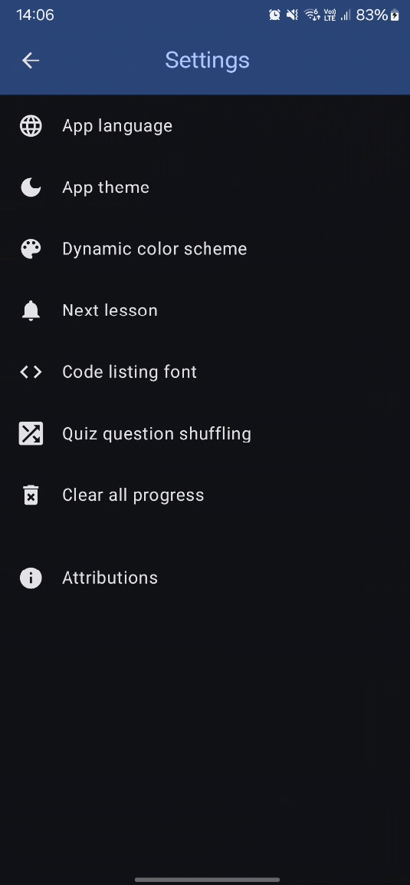

# Jetpack Compose Tutorial

## Overview
This application serves as a learning aid for developers getting started with Jetpack Compose,
the modern UI toolkit for Android. It provides interactive lessons,
quizzes, and hands-on coding examples to help users build Android applications efficiently.

---

## Courses and Lessons
The core of the application consists of interactive lessons.
Each lesson comprises multiple pages explaining a specific concept, accompanied by:
- **Descriptive text** outlining key details
- **Code blocks** with partial syntax highlighting showcasing examples
- **Interactive previews** allowing users to examine UI components in real-time

The application offers over **30 lessons**, covering topics from setting up the
development environment to advanced concepts such as managing runtime permissions and persisting user preferences.

### Course Structure
Lessons are grouped into courses based on their subject matter and structured to ensure a smooth learning curve.
Whenever possible, concepts are introduced in a logical sequence, with simpler topics preceding more advanced ones.

User progress is stored locally using the [Room Database](https://developer.android.com/jetpack/androidx/releases/room).

### Available Courses:
#### **1. Getting Started with Jetpack Compose**
- What is Jetpack Compose?
- Setting up the environment
- Creating your first composable

#### **2. Jetpack Compose Basics**
- Displaying text
- Buttons
- Text fields
- Images
- Cards
- Using modifiers
- Toast messages

#### **3. UI Layout**
- Column and row
- Box
- Grid
- Scaffold
- Bottom sheet
- Pager

#### **4. Styling the UI**
- Color scheme
- Material Theme
- App themes and dynamic colors

#### **5. State and Lifecycle**
- Lifecycle of composables
- Remembering state
- Side effects
- Using ViewModel
- Persistent state

#### **6. Navigation**
- Nav controller and host
- Navigation containers
- Back handler

#### **7. Animations**
- Animating values
- Animating content
- Navigation transitions

#### **8. Advanced Topics**
- App permissions
- System notifications
- Camera access
- Biometric authentication
- Dependency injection with Hilt
- Room Database

---

## Quizzes
To reinforce learning, the application includes interactive quizzes for nearly every lesson.
Each quiz consists of multiple-choice questions. Users can review previous answers but cannot modify them unless the quiz is reset.

### Quiz Features:
- Immediate feedback on correct/incorrect answers
- Ability to review previous responses
- Summary screen after completing all questions

**Correct answer example:**

**Incorrect answer example:**

**Quiz summary:**

---

## Bookmarking Lessons
Users can add lessons to their bookmarked list for quick access. Bookmarking data is stored locally in the database.

---

## Personalization and User Preferences
The application offers various customization options, allowing users to tailor the experience to their needs.

### Available Preferences:
- **Change UI language** (dynamic switching)
- **Switch between light and dark mode**
- **Enable dynamic color themes** (Android 12+)
- **Toggle lesson suggestions popup**
- **Adjust font size of code blocks**
- **Enable shuffle mode for quizzes**

User preferences are managed via the [DataStore](https://developer.android.com/jetpack/androidx/releases/datastore) library.

The application interface, lesson content, and quizzes all support dynamic language switching.

**Settings screen:**

**After language and theme change:**

---

## Handling Runtime Permissions
The application does not require any system permissions to function.
However, certain lessons demonstrate the process of requesting and utilizing permissions.

### Example Notifications:
- **After declining permission:**

  

- **After permanently denying permission:**

  